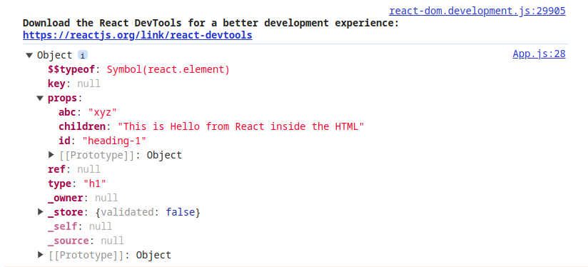

# Lecture 1

## What is CDN?
- CDN stands for Content Delivery Network.
- CDN links are where React or any other service is hosted.
- We can fetch or pull React/any other service from that link.

## What is crossOrigin?
- Used when we need to request resources from a different origin.
- The `crossorigin` attribute is used to share resources from one domain to another.
- It handles Cross-Origin Resource Sharing (CORS) requests.
- Ensures that it is safe to allow sharing of resources from other domains.

## What is Profiler?
- The Profiler measures the performance of a component or the entire app.
- Allows you to measure the rendering performance of a React tree programmatically.

```jsx
<App>
  <Profiler id="Sidebar" onRender={onRender}>
    <Sidebar />
  </Profiler>
  <Profiler id="Content" onRender={onRender}>
    <Content>
      <Profiler id="Editor" onRender={onRender}>
        <Editor />
      </Profiler>
      <Preview />
    </Content>
  </Profiler>
</App>
```

## What is Strict Mode?
- Strict Mode enables extra development-only checks for the entire component.
  
### Double Rendering Issue:
- [Read more about fixing bugs found by double rendering in development](https://react.dev/reference/react/StrictMode#fixing-bugs-found-by-double-rendering-in-development).

- React assumes that every component you write is a pure function. 
  - Pure Function does not re-render when the state or value updated with the same value
- To fix the double rendering issue, create a copy of the array so that when the component re-renders, it starts again with a fresh copy.
- [Re-Rendering of useEffect](https://react.dev/reference/react/StrictMode#fixing-bugs-found-by-re-running-effects-in-development):
  - When Strict Mode is on, React runs an extra setup + cleanup cycle in development for every Effect.
  - This helps reveal subtle bugs that are hard to catch manually.
  - To solve this problem, use a cleanup function.
- [Read more about fixing bugs found by double rendering in development](https://react.dev/reference/react/StrictMode#fixing-bugs-found-by-double-rendering-in-development).


# Summary of Lecture 1

- **Created Hello World Application in HTML**
- **Created Hello World Application in JavaScript**
- **Created Hello World Application in React by Injecting CDN Links**
  - Injected React CDN Links:
    ```html
    <script crossorigin src="https://unpkg.com/react@18/umd/react.development.js"></script>
    <script crossorigin src="https://unpkg.com/react-dom@18/umd/react-dom.development.js"></script>
    ```
  - **1st link**: Injects core React features into the application.
  - **2nd link**: Required for working with the DOM in the browser.

- **Creating Elements in React**
  - We can create elements in React using `React.createElement()`.
  - Need to create a root in React using `ReactDOM.createRoot()`.
  - `createRoot()` creates a root in the React application.
  - To render, we use `root.render()`.

- **Important Points**
  - `React.createElement()` takes 3 inputs:
    1. **Type**: e.g., `div`, `h1`, `span`
    2. **Attributes**: e.g., `class`, `id`
    3. **Children**

  - Example:
    ```javascript
    React.createElement(
      "h1",
      {
        id: "heading-1",
        abc: "xyz",
      },
      "This is Hello from React inside the HTML"
    );
    ```
  - `createElement` is an object.
  

- **Rendering Nested Child Elements in the DOM**
  - Example of nested structure:
    ```javascript
    const nestedStructure = React.createElement("div", { id: "parent" }, [
      React.createElement("div", { id: "child" }, [
        React.createElement("h1", { class: "h1-tag" }, "This is a h1 Tag"),
        React.createElement("h2", {}, "This is a h2 Tag"),
      ]),
      React.createElement("div", { id: "child2" }, [
        React.createElement("h1", { class: "h1-tag" }, "This is a h1 Tag"),
        React.createElement("h2", {}, "This is a h2 Tag"),
      ]),
    ]);
    ```

- **React Replaces Everything Inside "root"**
  - React will overwrite everything inside the element with `id="root"` and replace it with whatever is given inside `render()`.
