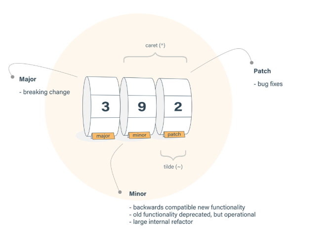

# Lecture 2

## Difference Between Caret and Tilde

1. Caret (`^`)

- Main Difference is of Versioning eg: 1.2.3, which know as
    - 1 as Major
    - 2 as Minor
    - 3 as Patch

- So, **Caret** automatically updates the **minor/Patch** versions by using `npm i`
- Syntax:
  ```json
  "react": "^18.2.0"
  ```
  
2. Tilde (`~`)
- So, **Tild** automatically updates the **Patch** versions by using `npm i`

- Syntax:  
  ```json
  "react": "~18.2.0"
  ```



## what is package-lock.json
- It locks the package version of the particular Version, no Caret and No Tilde Sign, It just Locks the Version

## Babel & Parcel
1. **Parcel**
    - **Parcel is a bundler**.
    - Think of it as a tool that takes all your project files (JS, TS, CSS, images, etc.) and **bundles them into something the browser can run efficiently.**

-  🔧 **What Parcel does**
    - Takes **all your files** (.js, .ts, .css, .html, .jpg, etc.)
    - Figures out the **dependency graph** (which file imports what).
    - Bundles them into optimized output **(minified JS, optimized images, etc)**
    - Gives you **Hot Module Reloading (HMR)** while developing.
    - Without bundlers, in your HTML you’d need multiple `<script>` tags:

2. **Babel**
    - **Babel** is a **JavaScript compiler (transpiler)**.
    - It allows you to write **modern JavaScript/React (ES6+)** and still support **older browsers**.

- 🔧 **What Babel does**
    - Converts **modern JS (ES6/ES7) → older JS (ES5).**
    - Converts JSX (**React syntax) → plain JS (React.createElement calls).**
    - Supports TypeScript if you configure it.

### Important Point
- There are mutiple json files inside a single project inside node modules
- In React, Whenver we make changes in the code, by Browser automatically Detects it, and run this is done by **Parcel**
- So Reloading of the page is done by **Parcel**
- **Parcel** make the dev build
- **Parcel** make the local Servcer
- Parcel gives faster build using caching
- Parcel also do image optimization
- Tree Shaking - remove unused code 
- Also serve your app in HTTPS
- Browser list, we can add it in the package.json, to support all the browser
- Read more about [Parcel](https://parceljs.org/)


# Lecture 3
- `React.createElement()` is an Object, lots of developer says it is an HTLM Tag/ HTML Element
- When we render this Object or Element is Becomes HTLM Tag/ HTML Element
- JSX Code is Transpiled before its reaches to the Browser- THIS IS DONE BY PARCEL, but PARCEL do not do it alone
- **This is DONE BY BABEL**
- **Babel** Transpiled the code
- When we use `React.createElement`
    - `React.createElement` ===> `JS Object` ====> HTML TAG
- When we use `JSX`
    - `JSX` ====> `React.createElement` ====> `JS Object` ====> HTML Tag
- `BABEL` is convereting the JSX into React.createElement

- **IMPORTANT** [See how Babel Converts the code](https://babeljs.io/)